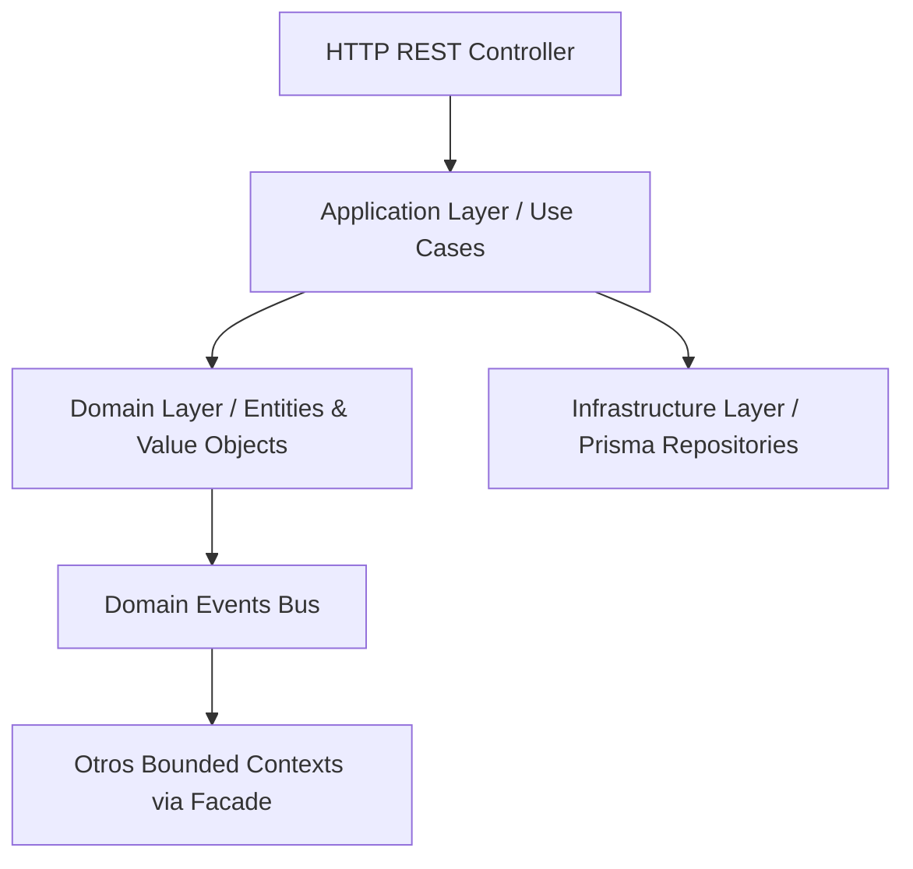

# System Overview - TECNOJACK API

## 1. Visión General del Backend

El backend de **TECNOJACK** es el motor que impulsa una plataforma de gestión de fotografía profesional. Centraliza la gestión de clientes, oportunidades de venta, contratos legales, pagos, invitaciones digitales interactivas, galerías de fotos, entregables físicos y digitales, y el ciclo operativo completo de eventos fotográficos.

## 2. Arquitectura

El sistema adopta una arquitectura de **Monolito Modular** con separación estricta de contextos. Cada Bounded Context es completamente autónomo, pudiendo ser extraído como microservicio en el futuro sin modificación de su lógica de dominio.

Los principios que guían la arquitectura son:
- **Domain-Driven Design (DDD)**: Dominios autónomos con modelos ricos.
- **Clean / Hexagonal Architecture**: Separación de capas (Domain → Application → Infrastructure → Presentation).
- **CQRS Ligero**: Comandos (Use Cases de mutación) separados de Queries (Use Cases de lectura).
- **Event-Driven interno**: Los Aggregate Roots emiten Domain Events que otros contextos pueden observar.

### Diagrama de Capas

---

## 3. Stack Tecnológico

| Capa | Tecnología |
|------|-----------|
| Framework | NestJS (Node.js + TypeScript) |
| ORM | Prisma |
| Base de Datos | PostgreSQL |
| Autenticación | JWT (Access + Refresh Token Rotation) |
| Documentación API | Swagger / OpenAPI |
| Testing | Jest |
| Linting | ESLint + @typescript-eslint |

---

## 4. Bounded Contexts

| Dominio | Responsabilidad Principal | Aggregate Roots |
|---------|--------------------------|-----------------|
| **Identity & Access** | Autenticación, autorización, sesiones, API Keys, RBAC+ABAC | User, Role, Permission, Policy, Session, APIKey |
| **Administration** | Feature flags, configuraciones, catálogos, widgets | SystemSetting, FeatureFlag, Catalog, DashboardWidget |
| **CRM** | Pipeline de ventas, leads, cotizaciones, actividades | Opportunity, Quotation, CRMActivity, CRMTask |
| **Events** | Logística de eventos fotográficos y sesiones | Event, EventSession, Location |
| **Contracts** | Contratos legales, versiones y firmas | Contract, ContractVersion, ContractParty |
| **Payments** | Transacciones, cuotas, estados de cuenta | Payment, PaymentTransaction, PaymentInstallment |
| **Invitations** | Invitaciones digitales interactivas, RSVP | Invitation, InvitationGuest, InvitationSection, InvitationSchedule |
| **Gallery** | Galerías de fotos del cliente, álbumes | Gallery, GalleryAlbum, GalleryAssetReference |
| **Media** | Registro y metadatos de assets multimedia | MediaAsset |
| **Deliverables** | Entregables digitales y físicos post-evento | Deliverable, DeliverableItem |
| **People** | Clientes, contactos, organizaciones | Person, Organization |
| **Notifications** | Motor de correos, plantillas y seguimiento | Notification, NotificationTemplate, NotificationRecipient |
| **Client Portal** | Vista compuesta del cliente (lectura) | (Facade-only, sin agregados propios) |
| **Storage** | Abstracción del almacenamiento de archivos | (Infrastructure-only) |

---

## 5. Métricas del Backend (a la fecha WO-018)

| Métrica | Valor |
|---------|-------|
| Bounded Contexts | 14 |
| Aggregate Roots | 42 |
| Domain Entities (total) | 42 |
| Prisma Models | 45 |
| Prisma Schemas | 12 |
| Use Cases | 85 |
| HTTP Controllers | 16 |
| API Endpoints | ~140 |
| Domain Events | ~80 |
| Test Suites | 46 |
| Tests Passing | 131 |
