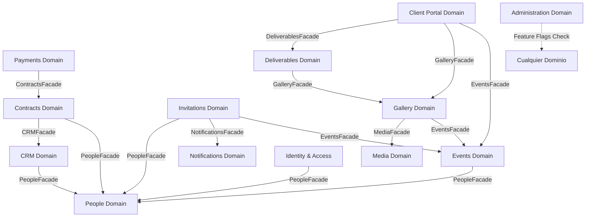

# Domain Map - Context & Dependencies Mapping

## 1. Mapa Completo de Dependencias entre Dominios

## 2. Tabla de Facades Expuestas

| Dominio | Facade Expuesta | Consumidores |
|---------|----------------|-------------|
| **People** | `PeopleFacade` | IAM, CRM, Contracts, Events, Invitations |
| **Events** | `EventsFacade` | Invitations, Gallery, Client Portal |
| **Notifications** | `NotificationsFacade` | Invitations (y futuros consumidores) |
| **Media** | `MediaFacade` | Gallery |
| **Gallery** | `GalleryFacade` | Deliverables, Client Portal |
| **Contracts** | `ContractsFacade` | Payments |
| **CRM** | `CRMFacade` | Contracts |
| **Deliverables** | `DeliverablesFacade` | Client Portal |
| **Administration** | `AdministrationFacade` | Feature flags para cualquier contexto |

## 3. Reglas de Comunicación entre Contextos

1. **Zero Repository Leak**: Ningún contexto accede a repositorios Prisma de otro.
2. **Facade-Only Access**: Solo los métodos definidos en la Facade son accesibles externamente.
3. **Domain Events para Asincronía**: Los cambios de estado que requieren reacción en otros dominios se propagan mediante `DomainEventBus`, no por llamadas directas síncronas.
4. **Compilation Boundary**: Un cambio en el modelo interno de un dominio no rompe la compilación de sus consumidores mientras se respete la firma de la Facade.
