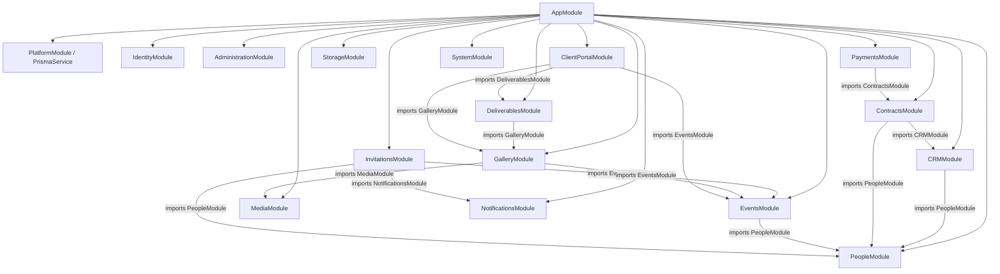

# Module Dependencies - Technical Relationships

## 1. Mapa Técnico de Dependencias (AppModule)

## 2. Módulos que Exportan Facades

| Módulo | Exporta |
|--------|---------|
| `PeopleModule` | `PeopleFacade` |
| `EventsModule` | `EventsFacade` |
| `NotificationsModule` | `NotificationsFacade` |
| `MediaModule` | `MediaFacade` |
| `GalleryModule` | `GalleryFacade` |
| `ContractsModule` | `ContractsFacade` |
| `CRMModule` | `CRMFacade` |
| `DeliverablesModule` | `DeliverablesFacade` |
| `AdministrationModule` | `AdministrationFacade` |

## 3. Módulos de Plataforma (Compartidos)

| Módulo | Descripción |
|--------|-------------|
| `PrismaService` | Proveedor global de conexión a PostgreSQL, inyectado en todos los repositorios |
| `StorageModule` | Abstracción del almacenamiento de archivos (Local / S3), inyectado en Media |
| `SequenceGeneratorPort` | Proveedor de Business Codes (`USR-000001`) |
