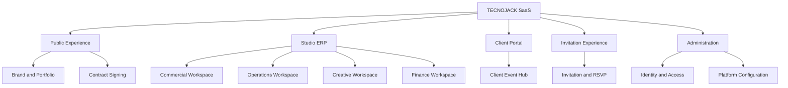
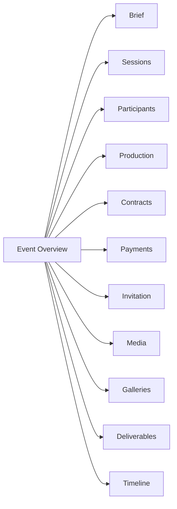
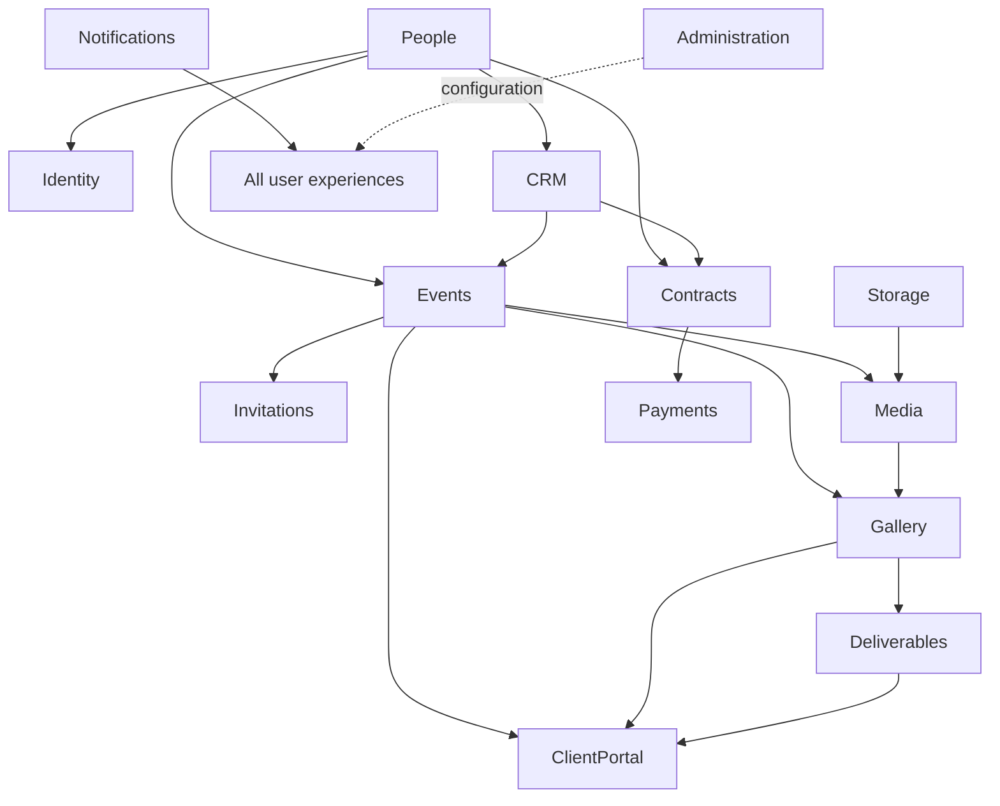

# 01 — Information Architecture

## 1. Product hierarchy



## 2. Product surfaces

### 2.1 Public area

- Brand home and portfolio.
- Services, categories, packages and client work.
- Contact and lead capture.
- Terms and policies.
- Tokenized contract review/signing.
- Public or protected invitation.

Public pages optimize discovery and conversion. They do not expose ERP navigation.

### 2.2 Studio ERP

Authenticated environment for staff. It is divided by jobs-to-be-done rather than backend deployment boundaries.

| Workspace | Primary roles | Modules |
| --- | --- | --- |
| Home | All internal roles | Dashboards, search, notifications |
| Commercial | Sales, owner | CRM, People, Quotations, Contracts |
| Operations | Producer, coordinator | Events, Production, Invitations |
| Creative | Photographer, videographer, editor | Media, Gallery, Deliverables |
| Finance | Finance, owner | Payments, Contracts, reports |
| Administration | Admin | IAM, settings, catalogs, flags, widgets, audit, health, CMS |

### 2.3 Client Portal

Event-scoped experience with no data ownership. It aggregates authorized information from Events, Galleries and Deliverables, with planned Contracts, Payments and Notifications views.

### 2.4 Invitation Experience

Guest-facing microsite. It may be public, password protected or guest-list restricted. It exposes theme, sections, schedule, location and RSVP only while published and not expired.

### 2.5 Administration

High-risk area for users, roles, permissions, policies, API keys, sessions, settings, flags, catalogs, widgets, audit and system health.

## 3. Canonical navigation hierarchy

```text
Home
Commercial
  CRM Pipeline
  Opportunities
  Activities & Tasks
  People
    Persons
    Organizations
  Quotations
Operations
  Events
  Calendar
  Production
  Invitations
Creative
  Media Library
  Uploads
  Galleries
  Deliverables
Finance
  Portfolio
  Payments
  Installments
  Transactions
  Contracts
Notifications
Reports
Administration
  Users & Access
  Settings
  Catalogs
  Feature Flags
  Dashboard Widgets
  Audit
  Health & Integrations
  CMS
```

Navigation items are permission-aware. Hidden modules are not rendered. A disabled item is used only when awareness of an unavailable capability helps the user.

## 4. Event workspace

Event is the contextual hub, not the owner of every tab.



Each tab identifies its source module and links to the full module view. Cross-module mutations use the source module's command flow.

## 5. User entry points

| Entry point | Audience | Destination |
| --- | --- | --- |
| Email/password | Staff | Role dashboard |
| Magic-link future | Client | Client Event Hub |
| Contract token | Client/party | Contract signing |
| Invitation URL | Guest | Invitation experience |
| API key | Integration | Scoped API only |
| Deep notification link | Authorized user | Source record/action |
| Global search result | Staff | Entity detail |

## 6. Module relationships



Arrows mean “is consumed by”, not table access. UI composition never changes ownership.

## 7. Mobile hierarchy

### Field staff

`Today · Schedule · Upload · Tasks · More`

### Sales

`Home · Pipeline · Tasks · People · More`

### Client

`Home · Event · Gallery · Deliveries · More`

### Guest

Single scroll experience with sticky section navigator only when content length requires it.

## 8. Context switching

- Tenant/studio switcher is reserved in the global header.
- Event switcher appears only inside Event-scoped work.
- Selected tenant and Event are always visible.
- Switching context warns when unsaved data exists.
- Client and guest users never see tenant administration.

## 9. Global utilities

- Search/command palette.
- Create menu.
- Notifications.
- Help/support.
- User menu.
- Studio switcher.
- Background activity/upload status.

