# 02 — User Flows

## 1. End-to-end business journey

**Objective:** convert commercial interest into a completed, paid and delivered audiovisual engagement.  
**Preconditions:** staff user, tenant context, minimum CRM/People permissions.  
**Permissions:** cumulative per source module; no cross-module super-action.  
**Related screens:** Pipeline, Opportunity, Quotation, Contract, Payment, Event Workspace, Production Board, Media, Gallery, Deliverable, Client Portal.  
**APIs:** `/crm/opportunities`, `/contracts`, `/payments`, `/events`, `/media-assets`, `/galleries`, `/deliverables`, `/client-portal`.

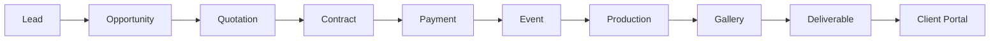

**Happy path:** qualify → quote accepted → contract executed → deposit recorded → Event activated → production executed → assets curated → gallery approved → deliverable released.  
**Alternatives:** create Event before contract; multiple contracts/payments/galleries/deliverables; invitation optional.  
**Errors:** duplicate person, expired quote, incomplete signatures, failed payment, schedule conflict, upload failure, blocked delivery.

---

## 2. CRM journey

**Objective:** qualify demand and win or close an Opportunity.  
**Preconditions:** Person/Organization exists or can be created.  
**Permissions:** `opportunities:read/write`, quotation and activity permissions.  
**Screens:** Pipeline, Opportunity List, Opportunity Detail, Quotation Editor, Activity/Task Drawer.  
**APIs:** create/list/get/update; `/:id/stage`, `/:id/convert`, quotations, activities and tasks.

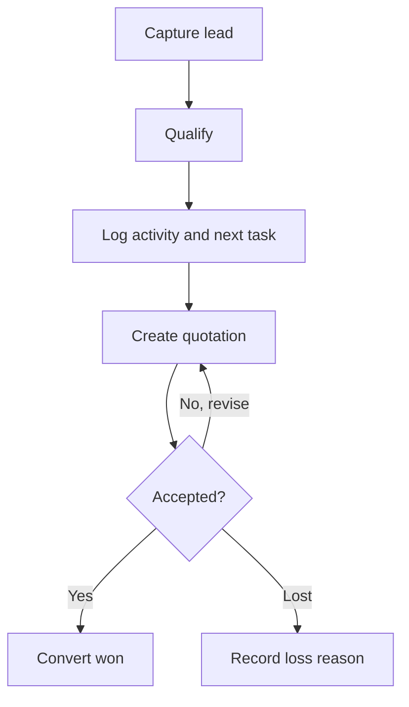

**Alternative flows:** lead remains unqualified; multiple quotations; reassignment; restore archived Opportunity.  
**Error flows:** duplicate identity, invalid stage transition, stale update, quote rejected/expired, insufficient permission.

## 3. Events journey

**Objective:** plan and govern the audiovisual engagement.  
**Preconditions:** EventType, owner, timezone and minimum identity data.  
**Permissions:** `events:read/create/update/transition/archive`.  
**Screens:** Event List, Calendar, Create Wizard, Workspace, Brief, Sessions, Locations, Participants, History.  
**APIs:** `/events` CRUD plus activate, phase, complete, cancel, sessions, archive/restore.

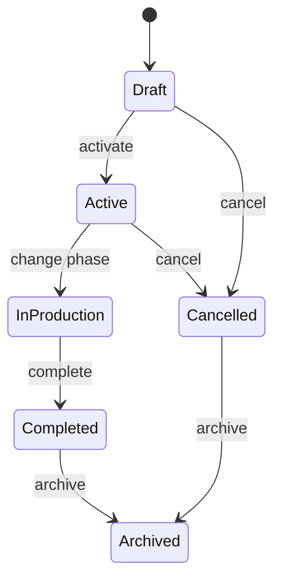

**Happy path:** choose type → set identity/brief → schedule sessions → activate → execute phases → complete → archive.  
**Alternatives:** tentative dates, reschedule session, multiple locations, cancellation with reason.  
**Errors:** invalid timezone/range, overlapping session policy, missing prerequisite, transition conflict.

## 4. Contracts journey

**Objective:** create a versioned agreement and obtain required signatures.  
**Preconditions:** Event and parties exist.  
**Permissions:** `contracts:read/create/update/publish/execute`. Client uses token-scoped signing.  
**Screens:** Contract List, Editor, Detail, Version Compare, Parties, Public Signing, PDF Preview.  
**APIs:** `/contracts` CRUD plus publish, execute, versions and parties.

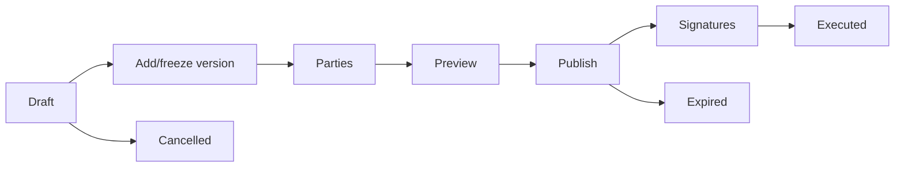

**Alternatives:** multiple parties, partial signature, new version before publication, custom contract.  
**Errors:** missing party, changed snapshot, expired token, rejected acceptance, PDF provider unavailable.

## 5. Payments journey

**Objective:** represent an obligation, schedule installments and record neutral financial movements.  
**Preconditions:** Event/Contract and payer reference.  
**Permissions:** `payments:read/create/record/mark-overdue/refund`; client has own-payment read/pay.  
**Screens:** Finance Dashboard, Payments Table, Payment Statement, Installment Plan, Transaction Dialog.  
**APIs:** `/payments`, transactions, installments, overdue, archive/restore.

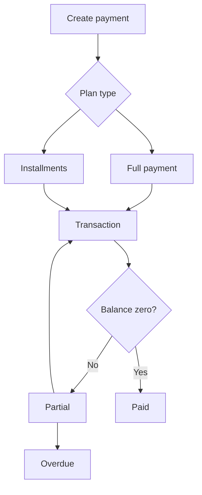

**Alternatives:** manual/external transaction, refund, adjustment, milestone plan.  
**Errors:** duplicate provider reference, amount exceeds policy, currency mismatch, gateway pending/failed.

## 6. Invitations journey

**Objective:** publish an Event microsite and manage guest responses.  
**Preconditions:** valid Event; host permission.  
**Permissions:** invitation edit/publish; guest receives invitation-scoped RSVP permission.  
**Screens:** Invitation List, Create, Layout Editor, Preview, Schedule, Guest List, RSVP Dashboard, Guest Portal.  
**APIs:** `/invitations` CRUD, duplicate, publish/unpublish, sections, schedules, guests and RSVP.

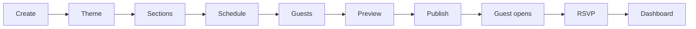

**Alternative flows:** public/password/guest-list visibility; duplicate template; decline; permitted companions.  
**Error flows:** slug unavailable, invitation draft, expired invitation, invalid password/token, companion limit exceeded. RSVP mutations are allowed only while `PUBLISHED` and unexpired.

## 7. Media journey

**Objective:** register and safely process audiovisual assets.  
**Preconditions:** upload destination and Storage availability.  
**Permissions:** `media:read/upload/update/archive/download` with Event scope.  
**Screens:** Media Library, Upload Manager, Processing Queue, Asset Detail, Bulk Selection.  
**APIs:** `/media-assets` register/list/get/update/archive/restore; binary operations through Storage capability.

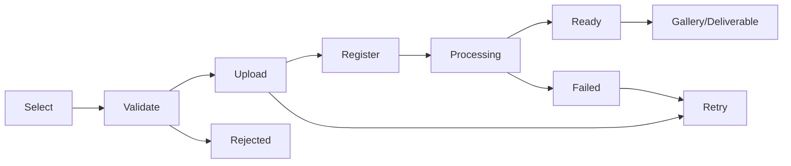

**Alternatives:** camera upload, batch upload, background sync, duplicate checksum warning.  
**Errors:** invalid type/size, quota, connection loss, checksum mismatch, processing failure.

## 8. Gallery journey

**Objective:** curate Media references and publish a controlled viewing experience.  
**Preconditions:** Event and READY Media Assets.  
**Permissions:** `galleries:read/create/curate/publish`; client selection permission when enabled.  
**Screens:** Gallery List, Builder, Album Organizer, Access Settings, Preview, Client Gallery, Selection Review.  
**APIs:** `/galleries` CRUD, publish/unpublish, albums, asset add/remove.

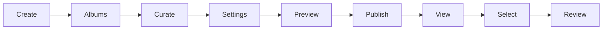

**Alternatives:** private/public/password protected; multiple Galleries per Event; unpublish.  
**Errors:** missing Media, unavailable asset, password failure, download blocked, stale selection.

## 9. Deliverables journey

**Objective:** define, prepare and record delivery of contractual results.  
**Preconditions:** Event; optional Gallery/Media/Contract references.  
**Permissions:** `deliverables:read/create/update/ready/deliver`.  
**Screens:** Deliverable List/Board, Detail, Items Editor, Ready Review, Delivery Dialog, Client Download.  
**APIs:** `/deliverables` CRUD, ready, deliver, items, archive/restore.

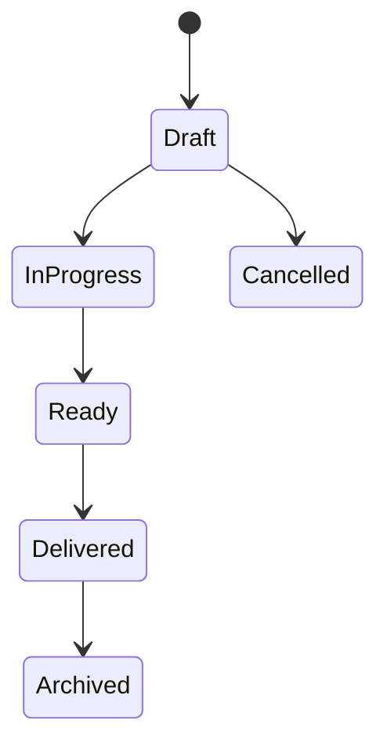

**Alternatives:** digital, pickup, shipping, courier; multiple items; partial operational preparation.  
**Errors:** missing item, payment/approval policy block, expired download, shipping details incomplete.

## 10. Notifications journey

**Objective:** render, schedule, dispatch and trace multichannel communication.  
**Preconditions:** recipient resolution and active template/provider.  
**Permissions:** `notifications:read/send/cancel/retry`; template administration separate.  
**Screens:** Outbox, Detail, Composer, Template List/Editor, Delivery History.  
**APIs:** `/notifications` create/list/get/cancel/retry/archive; templates create/get.

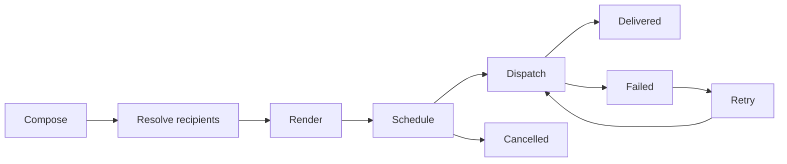

**Alternatives:** email, SMS, WhatsApp, push, in-app; immediate or scheduled.  
**Errors:** missing variable, invalid recipient, provider unavailable, retry exhausted.

## 11. Identity journey

**Objective:** authenticate and authorize human or programmatic access.  
**Preconditions:** tenant and account policy.  
**Permissions:** public auth endpoints; IAM management restricted.  
**Screens:** Login, Register, Verify, Reset, Users, Roles, Permission Matrix, Policies, Sessions, API Keys.  
**APIs:** `/auth/*` and `/access/*`.

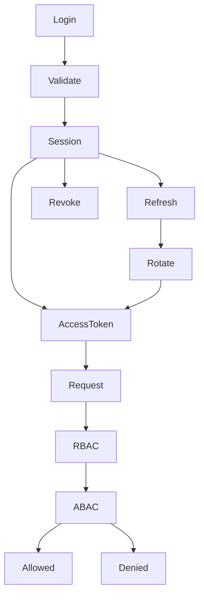

**Alternatives:** API key with scopes; future OAuth/SAML; revoke one/all sessions.  
**Errors:** unverified/locked user, invalid credentials, expired/reused refresh, tenant mismatch, policy denial. API key secret is displayed once.

## 12. Administration journey

**Objective:** configure platform behavior without changing code.  
**Preconditions:** administration permission and tenant scope.  
**Permissions:** granular settings, flags, catalogs, widgets and health access.  
**Screens:** Settings, Feature Flags, Catalogs, Dashboard Builder, Health, Audit.  
**APIs:** `/admin/settings`, feature flags, catalogs, widgets, health.

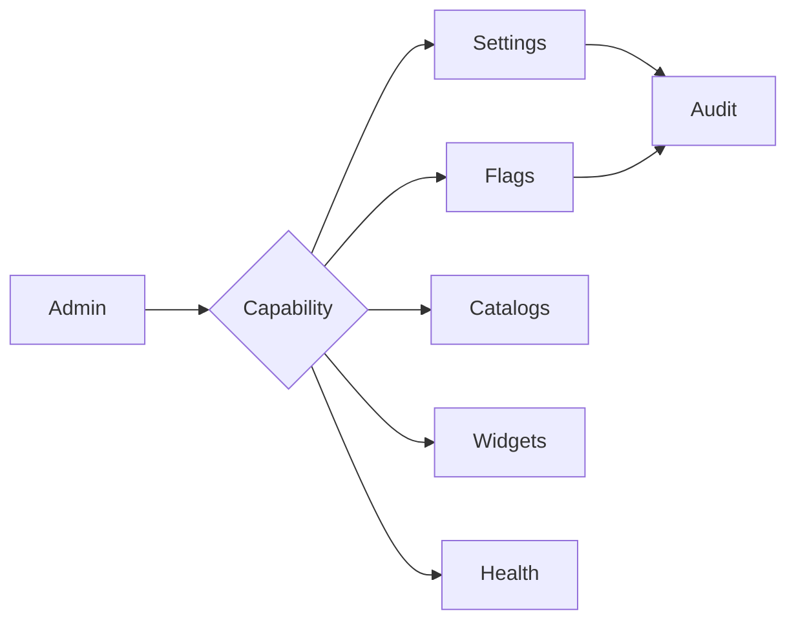

**Alternatives:** staged changes and tenant-specific values.  
**Errors:** protected key, duplicate catalog code, dependency in use, health service unavailable.

## 13. Client Portal journey

**Objective:** provide a simple Event-scoped experience without exposing internal operations.  
**Preconditions:** authorized participant/token and visible resources.  
**Permissions:** own Event scope only.  
**Screens:** Client Dashboard, Event Summary, Timeline, Contracts, Payments, Galleries, Deliverables, Invitation, Help.  
**APIs:** `/client-portal/events/:identifier/*` plus future authorized Contract/Payment facades.

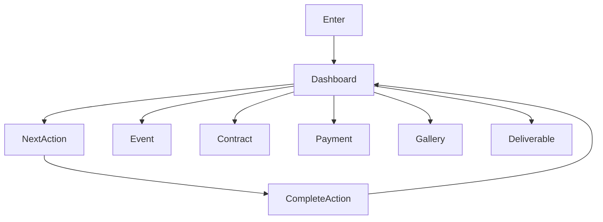

**Alternatives:** magic link, account login, multiple Events.  
**Errors:** expired link/session, resource not published, payment block, missing participant relation.

---

## 14. Role journeys

### Administrator

**Objective:** keep tenant secure and configured. **Preconditions:** admin role. **Permissions:** IAM/Admin/Audit. **Screens:** Admin Dashboard, Users, Roles, Policies, Settings, Health. **APIs:** `/access`, `/admin`.  
**Happy path:** inspect alert → change configuration/authorization → review audit evidence. **Alternatives:** revoke session/API key. **Errors:** self-lockout prevention, protected setting, stale policy.

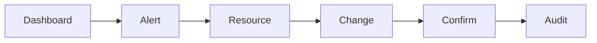

### Sales

**Objective:** progress Opportunities to signed business. **Preconditions:** assigned territory/tenant. **Permissions:** CRM, People and limited Contracts. **Screens:** Sales Dashboard, Pipeline, Opportunity, Quotation, Contract status. **APIs:** CRM/People/Contracts.  
**Happy path:** task → contact → quote → win → handoff. **Alternatives:** nurture/lost. **Errors:** duplicate contact, expired quote.

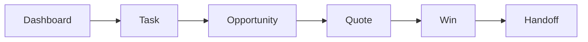

### Producer

**Objective:** make Events ready and executable. **Preconditions:** assigned Event. **Permissions:** Events/Production and related summaries. **Screens:** Operations Dashboard, Calendar, Event Workspace, Sessions, Team. **APIs:** `/events` and future Production.  
**Happy path:** inspect blockers → confirm brief/sessions/team → execute → handoff. **Alternatives:** reschedule. **Errors:** conflict, missing prerequisite.

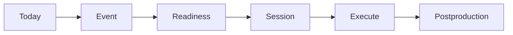

### Photographer

**Objective:** execute assigned sessions and safeguard captures. **Preconditions:** assignment. **Permissions:** scoped Event/Media. **Screens:** Mobile Today, Session Detail, Brief, Upload. **APIs:** Event read and Media/Storage upload.  
**Happy path:** open session → navigate → review brief → capture → upload → verify backup. **Alternatives:** offline queue. **Errors:** upload interrupted/quota.

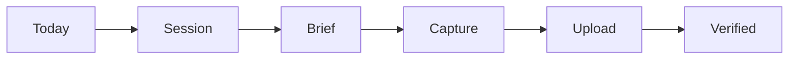

### Videographer

Same base journey as Photographer, with large-file upload, duration/codec metadata and proxy-processing emphasis.

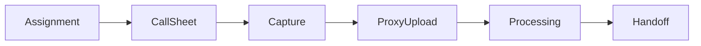

### Editor

**Objective:** transform ready assets into approved outputs. **Permissions:** Media/Gallery/Deliverables. **Screens:** Creative Dashboard, Queue, Media, Gallery Builder, Deliverable. **APIs:** media, galleries, deliverables.  
**Errors:** missing asset, failed processing, selection changed.

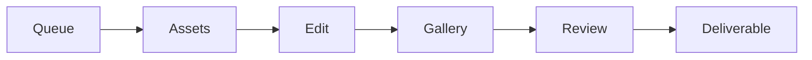

### Client

**Objective:** complete obligations and receive results. **Permissions:** Event-scoped own resources. **Screens:** Client Dashboard, Contract, Payment, Gallery, Deliverable.  
**Errors:** expired access, hidden draft, blocked download.

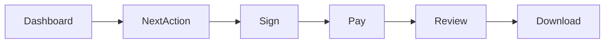

### Guest

**Objective:** understand invitation and respond. **Preconditions:** valid published invitation. **Permissions:** invitation/guest-scoped. **Screens:** Invitation Gate, Experience, RSVP, Confirmation.  
**Errors:** expired, invalid access, companion limit.

```mermaid
flowchart LR
  Link --> Gate --> Details --> RSVP --> Confirmation
```

