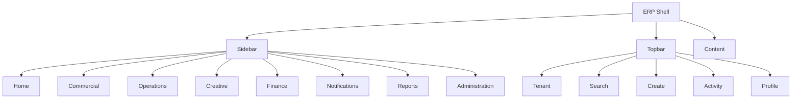
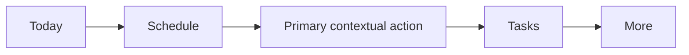
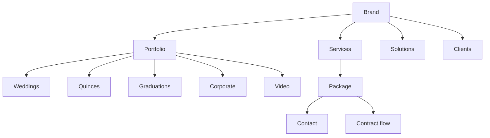
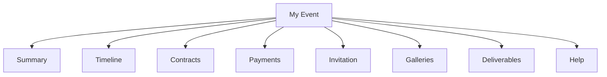
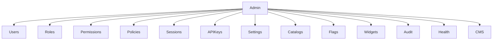
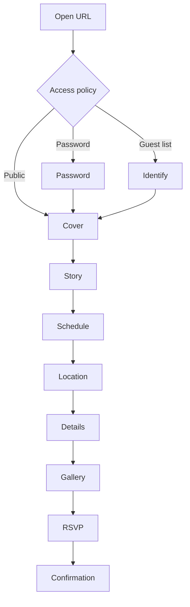

# 07 — Navigation Map

## 1. Desktop ERP

- Sidebar width: expanded 272 px; collapsed 72 px.
- Secondary navigation uses page tabs, not a second permanent sidebar unless the module has more than seven stable destinations.
- Breadcrumbs show hierarchy, not browser history.
- Primary action stays in page header.

## 2. Tablet

- Sidebar collapses to icon rail at ≥768 px.
- At narrower widths it becomes an overlay drawer.
- Data tables preserve priority columns and move secondary data into expandable rows.
- Event workspace tabs become horizontally scrollable.

## 3. Mobile ERP

- Five bottom destinations maximum.
- The center action may become Upload for creative roles or Create Activity for sales.
- Module list lives under More.
- Page actions use bottom sheets or sticky action bars.

## 4. Public site

Existing public routes remain conceptually separate from ERP navigation.

## 5. Client Portal

Desktop uses top navigation or compact sidebar. Mobile uses `Home · Event · Gallery · Deliveries · More`.

## 6. Administration

Administration is permission-gated and visually marked as a high-impact area.

## 7. Invitation Experience

## 8. Deep-link policy

- Deep links preserve intended destination after login.
- Unauthorized deep links resolve to 403, never silently to Home.
- Archived resources open read-only with status context.
- Expired invitation links show a branded expiration state.
- Removed resources use 404 without leaking existence across tenants.

## 9. Breadcrumb examples

- `Commercial / Opportunities / OPP-000143`
- `Events / EVT-000842 / Sessions / Pre-wedding`
- `Creative / Galleries / GAL-000221 / Ceremony`
- `Administration / Users / USR-000014 / Sessions`

