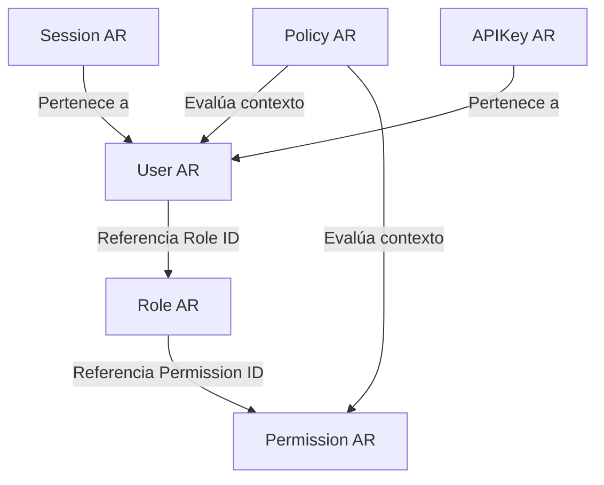

# Domain Design - Identity & Access Management (IAM)

This document presents the refined and comprehensive design for the **Identity & Access Management (IAM)** bounded context, incorporating architectural corrections to support enterprise-grade security and future SaaS multi-tenancy.

---

## 1. Ubiquitous Language (Glosario Refinado)
- **User (Usuario)**: Aggregate Root que representa la identidad única credencializada en el sistema.
- **Session (Sesión)**: Aggregate Root independiente que representa una sesión activa ligada a un dispositivo, IP y Refresh Token.
- **API Key**: Aggregate Root independiente para el acceso programático sin estado.
- **Role (Rol)**: Aggregate Root independiente que agrupa permisos y se asigna a los usuarios.
- **Permission (Permiso)**: Aggregate Root independiente que representa una capacidad atómica de ejecutar una acción en el sistema (ej: `galleries:write`).
- **Policy**: Aggregate Root independiente que define reglas de autorización dinámica evaluadas en tiempo de ejecución.
- **PolicyRule / Condition**: Reglas lógicas y condiciones del entorno o recursos que determinan si una Policy se evalúa como afirmativa.
- **Claim**: Par clave-valor embebido que declara metadatos y atributos de seguridad del usuario (ej: `tenantId`, `studioId`).
- **Tenant**: El identificador de frontera del cliente de nivel superior (estudio/negocio) que define el aislamiento de recursos y datos.

---

## 2. Bounded Context & Relaciones de Agregados

Los agregados de IAM están completamente desacoplados para permitir su evolución independiente:



---

## 3. Modelo Conceptual de los Agregados Definitivos

### 3.1. User [Aggregate Root]
- **Atributos**:
  - `Id` (UUID)
  - `Code` (USR-XXXXXX)
  - `Email` (String)
  - `PasswordHash` (String)
  - `Status` (ACTIVE, SUSPENDED, LOCKED, UNVERIFIED)
  - `IsEmailVerified` (Boolean)
  - `RoleIds` (Set<String>) - *Solo referencia al ID del rol, no a la entidad.*
  - `Claims` (Claim[]) - *Colección de Value Objects.*
  - `AuthenticationProviders` (AuthProvider[])
  - `AuditInfo` (AuditInfo VO)
- **Métodos**:
  - `assignRole(roleId)`
  - `revokeRole(roleId)`
  - `verifyEmail()`
  - `lockAccount()`
  - `addProvider(provider)`

### 3.2. Role [Aggregate Root]
- **Atributos**:
  - `Id` (UUID)
  - `Code` (ROL-XXXXXX)
  - `Name` (String)
  - `Description` (String)
  - `PermissionIds` (Set<String>)
  - `AuditInfo` (AuditInfo VO)
- **Métodos**:
  - `grantPermission(permissionId)`
  - `revokePermission(permissionId)`

### 3.3. Permission [Aggregate Root]
- **Atributos**:
  - `Id` (UUID)
  - `Code` (PRM-XXXXXX)
  - `Resource` (String, ej: `galleries`)
  - `Action` (String, ej: `write`)
  - `Description` (String)
- **Métodos**:
  - *Inmutable por diseño. Mutaciones de permisos se realizan creando/borrando registros.*

### 3.4. Policy [Aggregate Root]
- **Atributos**:
  - `Id` (UUID)
  - `Code` (POL-XXXXXX)
  - `Name` (String)
  - `Rules` (PolicyRule[])
  - `AuditInfo` (AuditInfo VO)
- **Métodos**:
  - `evaluate(evaluationContext): PolicyEvaluation`

### 3.5. Session [Aggregate Root]
- **Atributos**:
  - `Id` (UUID)
  - `Code` (SES-XXXXXX)
  - `UserId` (String)
  - `RefreshTokenHash` (String)
  - `IpAddress` (String)
  - `UserAgent` (String)
  - `DeviceType` (String)
  - `ExpiresAt` (DateTime)
  - `IsRevoked` (Boolean)
  - `AuditInfo` (AuditInfo VO)
- **Métodos**:
  - `revoke()`
  - `rotate(newHash, newExpiration)`

### 3.6. APIKey [Aggregate Root]
- **Atributos**:
  - `Id` (UUID)
  - `Code` (APK-XXXXXX)
  - `UserId` (String)
  - `KeyHash` (String)
  - `Name` (String)
  - `Scopes` (String[])
  - `ExpiresAt` (DateTime)
  - `IsActive` (Boolean)
  - `AuditInfo` (AuditInfo VO)
- **Métodos**:
  - `revoke()`
  - `rotate(newHash)`

---

## 4. Authentication Providers Model

El agregado `User` contiene una colección de `AuthProvider` (Value Objects) para soportar múltiples fuentes de autenticación:

```
+-----------------------------------+
|          AuthProvider             |
+-----------------------------------+
| - providerType: Enum              |  <-- LOCAL, GOOGLE, MICROSOFT, SAML, etc.
| - externalId: String              |  <-- ID del usuario en el sistema remoto
| - metadata: Record<string, string>|  <-- Tokens OAuth o detalles LDAP/SAML
+-----------------------------------+
```

---

## 5. Authorization Engine Flow (Roles -> Permissions -> Policies -> Claims)

```
[Request para ejecutar Acción en Recurso]
              ↓
  IdentityResolver obtiene User & Claims
              ↓
  PermissionResolver obtiene los PermissionIds asociados a los RoleIds del User
              ↓
  ¿El recurso solicitado coincide con el Permission?
              ↓ Sí
  PolicyEvaluator escanea las Policies aplicables al Permission y al Recurso
              ↓
  ¿Cumple con las PolicyRules evaluando los Claims del User y Atributos del Recurso?
              ↓ Sí
      [Acceso Autorizado]
```

---

## 6. Tenant Strategy (SaaS Ready)
Para soportar aislamiento multi-inquilino en el futuro sin modificar la arquitectura física de inmediato:
1. **Tenant ID a nivel de Agregado**: Los agregados `User`, `Role`, `Policy`, `Session` y `APIKey` contendrán un atributo implícito o claim `tenantId`.
2. **Context-Aware Facades**: Todos los casos de uso reciben un objeto de contexto de ejecución que incluye el `tenantId` derivado del dominio actual para forzar el filtrado por software en las capas de persistencia.

---

## 7. Servicios del Dominio (IAM Services)

- **`AuthenticationService`**: Maneja el flujo de login local y OAuth2, delegando en los proveedores externos correspondientes.
- **`AuthorizationService`**: Orquestador principal que determina si un acceso es válido.
- **`ClaimsResolver`**: Compila y decodifica las afirmaciones del usuario en tiempo de ejecución.
- **`PolicyEvaluator`**: Procesa las condiciones lógicas y reglas de las políticas.
- **`PermissionResolver`**: Agrupa y aplana la lista de permisos activos según los roles del usuario.
- **`RoleResolver`**: Resuelve la jerarquía e identificadores de roles activos.
- **`IdentityResolver`**: Extrae la identidad del usuario desde la petición (Session o API Key).
