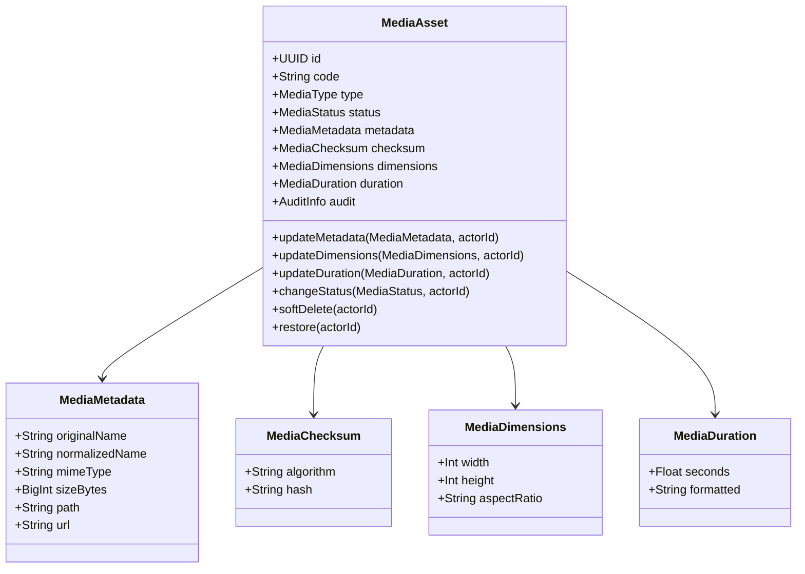

# Media Domain Design

**Estado:** Aprobado  
**Versión:** 1.0  
**Módulo:** `MEDIA`  
**Propietario:** Equipo de Ingeniería Backend TECNOJACK  
**Última actualización:** 11 de agosto de 2026  

---

## 1. Visión y Propósito del Dominio

El dominio **MEDIA** es el **propietario oficial de todos los activos digitales (Media Assets)** dentro de la plataforma TECNOJACK. 

Mientras que el dominio **STORAGE** administra la persistencia física de archivos binarios en el sistema de archivos o proveedores cloud, **MEDIA** administra el significado, metadatos, ciclo de vida e identidad de los activos digitales de la empresa.

### Principios Fundamentales

1. **Único Propietario de Activos Digitales:** Ningún otro módulo administrará directamente registros de archivos. Todo archivo cargado en la plataforma estará representado por un `MediaAsset`.
2. **Desacoplamiento Físico:** `MEDIA` no accede directamente al sistema de archivos ni a APIs de almacenamiento cloud. Consume exclusivamente `StorageFacade`.
3. **Agnosticismo de Lógica de Negocio Externa:** `MediaAsset` desconoce eventos comerciales, galerías, contratos o clientes. Se limita a representar los metadatos y el estado del activo digital.
4. **Identificador de Negocio (Business Code):** Cada activo digital cuenta con un código de negocio legible por humanos (ej., `MED-000123`) generado atómicamente por la secuencia PostgreSQL de plataforma `seq_code_med`.

---

## 2. Límites y Responsabilidades

### Responsabilidades de MEDIA

- Identidad y ciclo de vida del activo digital (`MediaAsset`).
- Registro de metadatos técnicos (`MediaMetadata`: nombre original, nombre normalizado, tamaño en bytes, tipo MIME, ruta física relativa, URL pública).
- Clasificación de tipos de medios (`MediaType`: `IMAGE`, `VIDEO`, `AUDIO`, `DOCUMENT`, `ARCHIVE`, `OTHER`).
- Registro de estado del activo (`MediaStatus`: `PROCESSING`, `READY`, `FAILED`, `ARCHIVED`).
- Integridad técnica mediante Checksum/Hash (`MediaChecksum`, `MediaHash`).
- Propiedades dimensionales y temporales opcionales (`MediaDimensions`: ancho/alto/aspectRatio; `MediaDuration`: segundos).
- Auditoría técnica y ciclo de vida (`AuditInfo`, `ISoftDeletable`).
- Emisión de Eventos de Dominio (`MediaAssetRegisteredEvent`, `MediaAssetUpdatedEvent`, `MediaAssetArchivedEvent`, `MediaAssetRestoredEvent`).

### Fuera del Alcance de MEDIA

- Organización en álbumes y galerías (pertenece a `GALLERY`).
- Vínculos con briefs y eventos (pertenece a `EVENTS`).
- Procesamiento multimedia pesado, compresión, transcoder o FFmpeg (pertenece al futuro dominio `MEDIA_PROCESSING`).
- Firmas temporales y distribución por CDN (infraestructura futura).

---

## 3. Modelo de Dominio (Domain Model)



---

## 4. Esquema de Persistencia Prisma

El esquema Prisma se define en `prisma/schema/media.prisma`:

```prisma
enum MediaType {
  IMAGE
  VIDEO
  AUDIO
  DOCUMENT
  ARCHIVE
  OTHER
}

enum MediaStatus {
  PROCESSING
  READY
  FAILED
  ARCHIVED
}

model MediaAsset {
  id             String      @id @default(uuid()) @db.Uuid
  code           String      @unique @db.VarChar(32)
  type           MediaType
  status         MediaStatus @default(READY)
  
  originalName   String      @map("original_name") @db.VarChar(255)
  normalizedName String      @map("normalized_name") @db.VarChar(255)
  mimeType       String      @map("mime_type") @db.VarChar(127)
  sizeBytes      BigInt      @map("size_bytes")
  path           String      @db.VarChar(512)
  url            String      @db.VarChar(1024)

  checksumAlgo   String?     @map("checksum_algo") @db.VarChar(32)
  checksumHash   String?     @map("checksum_hash") @db.VarChar(128)

  width          Int?
  height         Int?
  aspectRatio    String?     @map("aspect_ratio") @db.VarChar(20)

  durationSec    Float?      @map("duration_sec")

  createdAt      DateTime    @default(now()) @map("created_at")
  createdBy      String?     @map("created_by") @db.Uuid
  updatedAt      DateTime    @updatedAt @map("updated_at")
  updatedBy      String?     @map("updated_by") @db.Uuid
  deletedAt      DateTime?   @map("deleted_at")
  deletedBy      String?     @map("deleted_by") @db.Uuid

  @@index([code])
  @@index([type])
  @@index([status])
  @@index([checksumHash])
  @@index([deletedAt])
  @@map("media_assets")
}
```

---

## 5. Eventos de Dominio

1. `media.asset.registered`: Emitido al registrar un nuevo activo digital.
2. `media.asset.updated`: Emitido al actualizar metadatos, dimensiones o duración.
3. `media.asset.archived`: Emitido al realizar Soft Delete.
4. `media.asset.restored`: Emitido al restaurar el activo.
