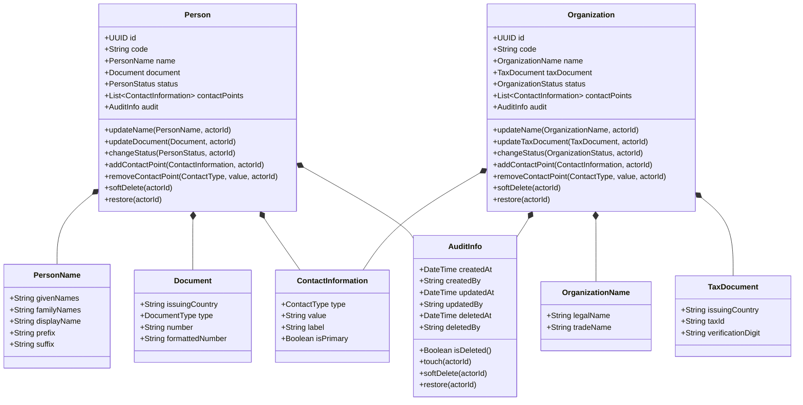
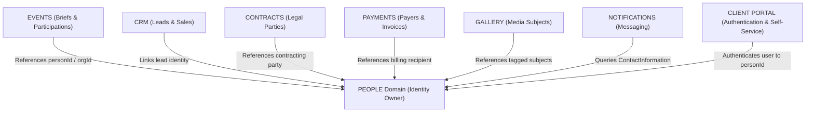

# People Domain Design

**Estado:** Aprobado  
**Versión:** 1.0  
**Módulo:** `PEOPLE`  
**Propietario:** Equipo de Ingeniería Backend TECNOJACK  
**Última actualización:** 11 de agosto de 2026  

---

## 1. Visión y Propósito del Dominio

El dominio **PEOPLE** es el **único propietario oficial de la identidad de personas y organizaciones** dentro de la plataforma TECNOJACK (ADR-003).

### Principios Fundamentales

1. **Agnosticismo de Rol:** `Person` y `Organization` representan identidades puras. No asumen condiciones comerciales ni operativas ("Cliente", "Novio", "Novia", "Empleado", "Proveedor", "Wedding Planner"). Esos conceptos pertenecen a dominios consumidores mediante relaciones contextuales (ej. `EVENTS`, `CRM`).
2. **Fuente Única de Verdad (Single Source of Truth):** Ningún otro módulo creará tablas propias para almacenar nombres, documentos de identidad o información de contacto de actores del negocio.
3. **Soporte Internacional por Diseño:** Las identidades, nombres, documentos y direcciones están diseñados para operar en múltiples países sin requerir migraciones de esquema o cambios en el código de dominio.
4. **Desacoplamiento Estricto:** `Organization` representa a la entidad colectiva pura. Las relaciones entre personas y organizaciones se gestionan fuera del dominio `PEOPLE`.

---

## 2. Límites y Responsabilidades

### Responsabilidades de PEOPLE

- Identidad única de personas naturales (`Person`).
- Identidad única de organizaciones / personas jurídicas (`Organization`).
- Información de contacto unificada (`ContactInformation`).
- Nombres internacionales (`PersonName`, `OrganizationName`).
- Documentos de identificación tributarios y nacionales (`Document`, `TaxDocument`).
- Auditoría técnica y ciclo de vida de registros (`AuditInfo`, Soft Delete).
- Publicación de eventos de dominio sobre cambios de identidad.

### Fuera del Alcance de PEOPLE

- Participación en eventos y briefs (pertenece a `EVENTS`).
- Roles comerciales e historial de ventas (pertenece a `CRM`).
- Firmas y partes de contratos (pertenece a `CONTRACTS`).
- Procesamiento de pagos y facturación (pertenece a `PAYMENTS`).
- Autenticación, credenciales y JWT (pertenece a `AUTH`).

---

## 3. Modelo de Dominio (Domain Model)

---

## 4. Clasificación DDD (Entities, Value Objects y Enums)

| Concepto | Clasificación DDD | Descripción / Regla |
| :--- | :--- | :--- |
| **`Person`** | **Entity / Aggregate Root** | Entidad individual. Identificador técnico `id` (UUIDv4) e identificador de negocio `code` (ej. `PER-000123`). |
| **`Organization`** | **Entity / Aggregate Root** | Entidad colectiva. Identificador técnico `id` (UUIDv4) e identificador de negocio `code` (ej. `ORG-000045`). |
| **`PersonName`** | **Value Object** | Nombre internacional. Contiene `givenNames`, `familyNames`, `displayName`, `prefix` y `suffix`. |
| **`OrganizationName`** | **Value Object** | Nombre de organización. Contiene `legalName` (razón social) y `tradeName` (nombre comercial). |
| **`Document`** | **Value Object** | Documento de identidad personal (`issuingCountry` ISO-3166-1 alpha-2, `type`, `number`, `formattedNumber`). |
| **`TaxDocument`** | **Value Object** | Documento tributario de organización (`issuingCountry`, `taxId`, `verificationDigit`). |
| **`ContactInformation`** | **Value Object** | Punto de contacto único (`type`, `value`, `label`, `isPrimary`). Encapsula correo, teléfono, WhatsApp, dirección, etc. |
| **`Address`** | **Value Object** | Dirección física internacional (`countryCode`, `addressLine1`, `addressLine2`, `locality`, `region`, `postalCode`, `formattedAddress`). |
| **`AuditInfo`** | **Value Object (Shared)** | Objeto de auditoría reutilizable en la plataforma (`createdAt`, `createdBy`, `updatedAt`, `updatedBy`, `deletedAt`, `deletedBy`). |
| **`PersonStatus`** | **Enum** | Estado de negocio: `ACTIVE`, `INACTIVE`. |
| **`OrganizationStatus`**| **Enum** | Estado de negocio: `ACTIVE`, `INACTIVE`. |
| **`DocumentType`** | **Enum** | `NATIONAL_ID`, `PASSPORT`, `TAX_ID`, `FOREIGN_ID`, `DRIVERS_LICENSE`, `OTHER`. |
| **`ContactType`** | **Enum** | `EMAIL`, `PHONE`, `WHATSAPP`, `ADDRESS`, `WEBSITE`, `SOCIAL_MEDIA`. |

---

## 5. Decisiones Arquitectónicas Detalladas

### 5.1 Nombres Internacionales (`PersonName`)
Para soportar monónimos (ej. "Cher"), múltiples apellidos (ej. "García Márquez"), orden oriental (apellido primero) y títulos/sufijos, `PersonName` no utiliza la tríada rígida `firstName/middleName/lastName`. Se compone de:
- `givenNames`: Nombres de pila.
- `familyNames`: Apellidos o nombres de familia (opcional/nullable para monónimos).
- `displayName`: Cadena completa formateada para mostrar en interfaces y comunicaciones.
- `prefix`: Título u honorífico (opcional, ej. "Dr.", "Sr.").
- `suffix`: Sufijo (opcional, ej. "Jr.", "III").

### 5.2 Direcciones Internacionales (`Address`)
Las direcciones se estructuran de forma agnóstica a divisiones territoriales locales:
- `countryCode`: Código ISO 3166-1 alpha-2 (`CO`, `US`, `JP`, `ES`).
- `addressLine1`: Vía principal, número, edificio o apartamento.
- `addressLine2`: Barrio, sector, urbanización o datos complementarios.
- `locality`: Ciudad, municipio o distrito.
- `region`: Departamento, estado, provincia o prefectura.
- `postalCode`: Código postal (opcional).
- `formattedAddress`: Cadena formateada completa para etiquetas físicas.

### 5.3 Información de Contacto Unificada (`ContactInformation`)
Se elimina la duplicidad de tener `Email` y `Phone` como objetos separados. `ContactInformation` es el Value Object único que encapsula cualquier medio de contacto mediante el `ContactType` Enum.
- La validación del formato del `value` (ej. RFC 5322 para `EMAIL`, E.164 para `PHONE`/`WHATSAPP`, URL para `WEBSITE`) es ejecutada internamente por la fábrica del Value Object según el `ContactType`.
- Cada agregador puede tener como máximo **un contacto primario (`isPrimary = true`) por cada `ContactType`**.

### 5.4 Separación entre Estado de Negocio y Soft Delete
Se separa estrictamente el **estado funcional del negocio** del **estado técnico de persistencia**:
- **Estado de Negocio (`PersonStatus` / `OrganizationStatus`)**: `ACTIVE` (operativo) o `INACTIVE` (suspendido / en verificación).
- **Estado Técnico de Registro (`Soft Delete`)**: Determinado por `AuditInfo.deletedAt` (`null` = activo físicamente; `timestamp` = dado de baja).
- *Consecuencia:* Un registro archivado por Soft Delete conserva su último estado de negocio intacto para auditoría e historial.

### 5.5 Identificadores de Negocio (`code`)
Además del identificador técnico surrogate (`id`: UUIDv4), cada `Person` y `Organization` incluye un código legible único (`code`) para interacción humana (ej. `PER-000123`, `ORG-000045`).
- **Justificación:** Los UUIDs son ideales para claves primarias y APIs internas, pero inviables para soporte telefónico, contratos impresos o facturación. Incorporar `code` desde el inicio evita refactorizaciones futuras.

---

## 6. Eventos de Dominio (Domain Events)

El dominio `PEOPLE` publica los siguientes eventos de dominio para notificación e integración asíncrona:

| Evento | Disparador | Payload Principal |
| :--- | :--- | :--- |
| **`PersonCreated`** | Creación de una persona | `personId`, `code`, `displayName`, `document`, `status`, `createdAt`, `createdBy` |
| **`PersonUpdated`** | Modificación de datos de una persona | `personId`, `code`, `updatedFields`, `updatedAt`, `updatedBy` |
| **`PersonArchived`** | Soft delete de una persona | `personId`, `code`, `deletedAt`, `deletedBy` |
| **`PersonRestored`** | Restauración de una persona eliminada | `personId`, `code`, `restoredAt`, `restoredBy` |
| **`OrganizationCreated`** | Creación de una organización | `organizationId`, `code`, `legalName`, `taxDocument`, `status`, `createdAt`, `createdBy` |
| **`OrganizationUpdated`** | Modificación de datos de organización | `organizationId`, `code`, `updatedFields`, `updatedAt`, `updatedBy` |
| **`OrganizationArchived`** | Soft delete de una organización | `organizationId`, `code`, `deletedAt`, `deletedBy` |
| **`OrganizationRestored`** | Restauración de una organización | `organizationId`, `code`, `restoredAt`, `restoredBy` |

---

## 7. Futuras Integraciones (Future Integrations)

El dominio `PEOPLE` se integrará progresivamente con el resto de la plataforma sin violar el ownership de datos:

### Responsabilidades por Dominio Consumidor

- **`EVENTS`**: Consultará `PEOPLE` para resolver identidades de participantes y asociarles roles contextuales (ej. Novio, Novia, Quinceañera, Planner). `EVENTS` no almacena datos personales.
- **`CRM`**: Creará identidades en `PEOPLE` al registrar un Lead u Oportunidad. El pipeline de ventas referencia `personId` / `organizationId`.
- **`CONTRACTS`**: Consumirá `Person` u `Organization` como partes contractuales (firmantes y contratantes).
- **`PAYMENTS`**: Vinculará las facturas y acuerdos de pago al `personId` o `organizationId` responsable del pago.
- **`GALLERY`**: Referenciará personas para etiquetado y permisos de visualización en galerías privadas.
- **`NOTIFICATIONS`**: Consultará `ContactInformation` (correo, WhatsApp, teléfono) para el despacho de mensajes.
- **`CLIENT PORTAL`**: Autenticará usuarios y los vinculará con su registro de `Person` en `PEOPLE`.

---

## 8. Estrategia de Evolución (Evolution Strategy)

### ¿Qué partes del modelo son estables y es muy poco probable que cambien?
- La condición de `PEOPLE` como **único propietario de la identidad** del negocio (ADR-003).
- La identificación técnica por `UUIDv4` e identificación legible por `code`.
- La abstracción del Value Object `ContactInformation` para encapsular medios de contacto.
- El objeto compartido de auditoría `AuditInfo` y la política de Soft Delete.

### ¿Qué partes probablemente evolucionarán en los próximos años?
- **Fusión de Identidades (*Merge*):** En el futuro se agregará la capacidad de fusionar dos registros duplicados de `Person` u `Organization` mediante el evento `PersonMerged` / `OrganizationMerged`.
- **Verificación de Identidad:** Integración con proveedores de validación biométrica o consulta de listas de riesgo.
- **Catálogos de Documentos:** Extensión de tipos de documentos específicos por país.

### ¿Qué extensiones ya se anticipan?
- Adición de nuevos canales en `ContactType` (ej. Telegram, TikTok, Instagram).
- Incorporación de etiquetas funcionales (*tags*) para segmentación básica no comercial.
- Soporte para avatares y fotografías de perfil integradas con el dominio `MEDIA`.

### ¿Qué decisiones se tomaron para permitir esa evolución sin romper compatibilidad?
- Usar Value Objects inmutables (`PersonName`, `Document`, `ContactInformation`), permitiendo alterar sus reglas internas de construcción sin modificar el esquema de base de datos ni las entidades principales.
- Modelar `ContactType` como Enum dentro de `ContactInformation`, permitiendo agregar nuevos tipos de contacto sin alterar la estructura de tablas.
- Mantener los roles contextuales completamente fuera de `PEOPLE`, garantizando que la adición de nuevos tipos de eventos o contratos en el futuro jamás requiera refactorizar el modelo de identidades.
